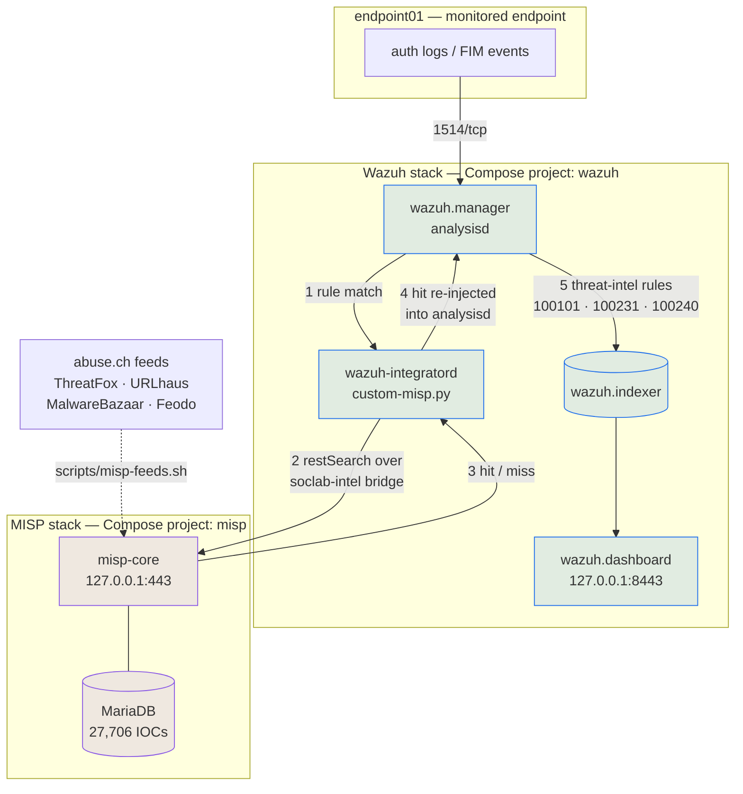

# SOC Home Lab — Wazuh + MISP

A local, Docker-only security operations lab that pairs **Wazuh** (SIEM/XDR) with
**MISP** (threat intelligence platform), so that alerts raised by Wazuh are automatically
enriched with real-world threat intel.

Built as a portfolio project to demonstrate SIEM deployment, detection engineering mapped
to MITRE ATT&CK, threat-intel integration, and an end-to-end incident response workflow —
all reproducible on a single machine with nothing but Docker.

Everything here runs. Every detection has been fired against live input, every alert
quoted in the documentation was captured from the running lab, and **157 automated checks**
assert it still works.

## At a glance

| | |
|---|---|
| **Stack** | Wazuh 4.14.7 (manager, indexer, dashboard, agent) · MISP 2.5.44 (core, modules, MariaDB, Valkey, mail) |
| **Footprint** | 9 containers, ~3.9 GB RAM, ~22 GB disk (11.6 GB images + 10.6 GB volumes) |
| **Threat intel** | 27,706 indicators from 4 curated abuse.ch feeds, loaded via the MISP API |
| **Detections** | 5 custom rules + 1 correlation rule, all mapped to MITRE ATT&CK |
| **Verification** | 157 checks across 6 suites |
| **Exposure** | Loopback only — no published port is reachable off the host |

## Architecture



Wazuh collects and detects; MISP holds the threat intel; the integration joins them. The
load-bearing detail is **step 4**: a MISP hit is written back into analysisd as a new event
rather than sent somewhere as a notification, so it is decoded, matched by rules, indexed
and correlated exactly like any other alert.

## Quick start

### Prerequisites

- **Docker Engine + Compose v2 ≥ 2.24** — the overrides use the `!override` YAML tag.
- **~6 GB free RAM and ~25 GB free disk.** The indexer alone takes a 1 GB JVM heap.
- **`vm.max_map_count` ≥ 262144** (`sysctl vm.max_map_count`). Fedora defaults far above
  this; other distros may need it raised.
- **Membership of the `docker` group.** If `docker ps` fails while `getent group docker`
  lists you, log out and back in — supplementary groups are granted by PAM at *login
  session* creation, so a new terminal tab inherits the same stale set. The scripts fall
  back to `sg docker` if they detect this.
- Internet access for the image pulls (~12 GB) and the feed fetch (~5 MB).

Built and tested on Fedora with SELinux **enforcing** — the scripts relabel bind mounts to
`container_file_t` where needed.

### Build the lab

```bash
git clone <this-repo> Project && cd Project

scripts/wazuh-bootstrap.sh    # clone upstream @ v4.14.7, generate .env, generate TLS certs
scripts/wazuh-passwords.sh    # replace the shipped demo credentials  ← before first start
scripts/misp-bootstrap.sh     # pinned clone, bind-mount dirs, generate misp/.env
scripts/misp-up.sh            # start MISP, wait for misp-core to report healthy  (~35s)
scripts/wazuh-up.sh           # start Wazuh, wait for the indexer to go green     (~25s)
scripts/misp-feeds.sh         # pull ~27k indicators from four abuse.ch feeds
```

**Two ordering constraints, both easy to trip over:**

1. **`wazuh-passwords.sh` must run before the first `wazuh-up.sh`.** On a cold start the
   indexer initialises its security index directly from `internal_users.yml`, so the stack
   comes up already using the new credentials. Run it later against a live stack and it
   rotates instead — same script, different path.
2. **`misp-bootstrap.sh` must run before `wazuh-up.sh`.** The Wazuh manager config is
   rendered at start-up with the MISP API key read out of `misp/.env`; without that file
   the integration comes up unable to authenticate, and every lookup silently 403s while
   the lab looks perfectly healthy.

Every script is idempotent — re-running one is always safe.

### Confirm it works

```bash
scripts/wazuh-check.sh  scripts/misp-check.sh  scripts/misp-feeds-check.sh
scripts/misp-integration-check.sh  scripts/detections-check.sh  scripts/incident-check.sh
```

Then open the dashboards (both use self-signed certificates, so expect a browser warning):

| UI | URL | Credentials |
|---|---|---|
| Wazuh dashboard | <https://127.0.0.1:8443> | `admin` / `INDEXER_PASSWORD` from `.env` |
| MISP | <https://127.0.0.1> | `admin@soclab.local` / `ADMIN_PASSWORD` from `misp/.env` |

### Day-to-day

```bash
scripts/wazuh-up.sh  scripts/misp-up.sh       # start (state lives in named volumes)
scripts/wazuh-down.sh  scripts/misp-down.sh   # stop  (--purge also deletes volumes)
scripts/wazuh-logs.sh [service]               # tail logs
scripts/demo-incident.sh                      # replay the full intrusion, ~2 min
```

A `docker compose down` does **not** lose the lab. All state — indexed alerts, the MISP
database, generated credentials, agent registration — lives in named volumes, so the
up-scripts restore everything.

## Detections

Five custom rules plus one correlation rule, each mapped to MITRE ATT&CK and each proven
by a captured alert. Every one **builds on** Wazuh's stock ruleset with `<if_sid>` /
`<if_matched_sid>` rather than replacing it — what stock lacks is context, not coverage.

| Rule | Level | Detection | ATT&CK |
|---|---|---|---|
| `100200` | 14 | **D1** — successful SSH login from a source that was brute-forcing moments ago | [T1110.001](https://attack.mitre.org/techniques/T1110/001/), [T1078](https://attack.mitre.org/techniques/T1078/) |
| `100210` | 12 | **D2** — security-critical file created or modified (sudoers, cron, `authorized_keys`, passwd) | [T1098.004](https://attack.mitre.org/techniques/T1098/004/), [T1053.003](https://attack.mitre.org/techniques/T1053/003/), [T1136](https://attack.mitre.org/techniques/T1136/) |
| `100220` | 12 | **D3** — new executable dropped into a system binary directory | [T1036.005](https://attack.mitre.org/techniques/T1036/005/), [T1543](https://attack.mitre.org/techniques/T1543/) |
| `100231` | 13 | **D4** — outbound connection to infrastructure MISP knows | [T1071.001](https://attack.mitre.org/techniques/T1071/001/), [T1571](https://attack.mitre.org/techniques/T1571/) |
| `100240` | 13 | **D5** — authentication attack from a threat-intel-listed host | [T1110.001](https://attack.mitre.org/techniques/T1110/001/) |
| `100103` | 14 | **Correlation** — repeated intel matches from one host across different signals | — |

The design constraint: stock Wazuh already detects brute force (5712) and file-integrity
changes (550/553/554), so re-implementing those would add rule count and no detection
value. Each rule here had to add something stock does not have — *a brute force that
**succeeded**, a file change **where it matters**, a destination that is **known-bad***.

```bash
scripts/demo-detections.sh     # simulate all five, safely
scripts/detections-check.sh    # 27 checks
```

## Example alerts

Real alerts, taken verbatim from
[`docs/incidents/incident-001-alerts.json`](docs/incidents/incident-001-alerts.json) and
trimmed to the interesting fields.

**Threat-intel enrichment — the whole point of the lab in one alert.** A failed SSH login
became an actionable finding one second after the first attempt, because MISP already knew
the source:

```json
{
  "rule": { "id": "100240", "level": 13,
            "description": "Authentication attack from threat-intel-listed host 50.16.16.211 against endpoint01",
            "mitre": { "id": ["T1110.001"], "tactic": ["Credential Access"],
                       "technique": ["Password Guessing"] } },
  "agent": { "id": "006", "name": "endpoint01" },
  "data": { "misp": {
      "observable": "50.16.16.211", "attribute_type": "ip-dst",
      "category": "Network activity", "to_ids": "True", "event_id": "1",
      "source_rule_id": "5710",
      "source_rule_description": "sshd: Attempt to login using a non-existent user" } }
}
```

`source_rule_id` is the pivot that makes it triageable: it names the event that caused the
lookup, so the analyst reads *"a known-bad host is failing to log in"* — not just *"we saw
a known-bad IP somewhere"*.

**Credential compromise.** A brute force is noise and a successful login is routine; the
conjunction, from one source, is the finding:

```json
{ "rule": { "id": "100200", "level": 14,
            "description": "Successful SSH login from 50.16.16.211, which was brute-forcing moments ago — probable credential compromise",
            "mitre": { "id": ["T1110.001", "T1078"] } },
  "full_log": "sshd[8100]: Accepted password for backupsvc from 50.16.16.211 port 45100 ssh2" }
```

**File integrity, re-scored by path.** Stock Wazuh reports that a file changed; this says
which file, and why it matters:

```json
{ "rule": { "id": "100210", "level": 12,
            "description": "Security-critical file created or modified: /root/.ssh/authorized_keys",
            "mitre": { "id": ["T1098.004", "T1053.003", "T1136"] } },
  "syscheck": { "path": "/root/.ssh/authorized_keys", "mode": "realtime", "event": "added",
                "sha256_after": "…", "uname_after": "root" } }
```

## Incident report

[**INC-2026-001 — SSH credential compromise of `endpoint01`**](docs/incident-report-example.md)
walks one simulated intrusion end to end: a host MISP already lists as botnet C2
brute-forces the endpoint, gets in, establishes three persistence mechanisms, drops an
implant and beacons back to infrastructure from the same feed. **45 alerts in 52 seconds**,
all real, all captured.

| T+ | Rule | Lvl | Stage |
|---:|---:|---:|---|
| 1s | 100240 | 13 | Credential access — auth attack from a threat-intel-listed host |
| 5s | 100103 | **14** | Correlation — repeated intel matches, possible active compromise |
| 18s | 100200 | **14** | Initial access — brute force → success = credential compromise |
| 23s | 100210 ×3 | 12 | Persistence — `authorized_keys`, sudoers drop-in, cron job |
| 29s | 100220 | 12 | Defense evasion — implant as `/usr/bin/systemd-udevd-helper` |
| 38s | 100231 | 13 | Command and control — beacon to known C2 |

The report covers the timeline, the MISP enrichment findings, an impact assessment that
states plainly what the telemetry **cannot** answer, the response an analyst would run,
and — because the exercise found them — **two detections that were silently not working**
until an intrusion was replayed across all of them at once.

```bash
scripts/demo-incident.sh       # replay the intrusion, ~2 min
scripts/incident-check.sh      # 47 checks, report against evidence
```

## Verifying the lab

Every phase ships a check suite. Together they say in a few minutes whether the lab is
intact — and they are written to fail loudly rather than reassure.

| Suite | Checks | Covers |
|---|---:|---|
| `wazuh-check.sh` | 17 | Stack health, credentials rotated, agent active, alerts indexed, loopback-only exposure |
| `misp-check.sh` | 15 | Health, API auth, default logins rejected, no plaintext credentials in logs |
| `misp-feeds-check.sh` | 25 | Feeds registered and parsed correctly, IOCs searchable, benign controls miss |
| `misp-integration-check.sh` | 26 | Network path, key substitution, file modes, live lookup, private-IP filter |
| `detections-check.sh` | 27 | Rules defined, loaded, ATT&CK-mapped, each firing — and negatives staying quiet |
| `incident-check.sh` | 47 | The incident report against its own evidence, plus regression guards |
| **Total** | **157** | |

Three habits these suites enforce, each learned the hard way:

- **A detection is not real until it has been watched firing against live input.** Wazuh
  fails silently in more ways than it fails loudly — a rule can load, look correct, and
  never fire. Five of the six documented traps produce no error at all.
- **Assert on rule *groups*, not rule IDs.** Adding a more specific rule supersedes a
  general one, so an ID-pinned test breaks against your own future rules.
- **Scope log checks to the current run.** `ossec.log` lives on a named volume and outlives
  container recreates; an unscoped grep keeps reporting faults fixed hours ago, and a check
  that never forgets is a check nobody believes.

## Repository layout

```
├── scripts/          bootstrap, up/down, feeds, demos, and six check suites
├── wazuh/
│   ├── compose.override.yml    loopback binding, config mounts, shared network
│   ├── config/                 tracked manager config (API key placeholder only)
│   ├── rules/local_rules.xml   all custom detections
│   └── integrations/           custom-misp.py — the MISP enrichment integration
├── misp/
│   ├── compose.override.yml    loopback binding, shared network
│   └── feeds.json              the feed list, as reviewable data
├── agents/           the monitored endpoint and its ossec.conf
└── docs/             one document per phase, plus the incident report
```

Upstream `wazuh-docker` and `misp-docker` are cloned at pinned versions into gitignored
directories, so **the diff from a stock deployment is small and auditable** — everything
this project changes lives in the two override files, the rules file and the integration.

## Documentation

- [`docs/setup-wazuh.md`](docs/setup-wazuh.md) — deploying and hardening the Wazuh stack
- [`docs/setup-agent.md`](docs/setup-agent.md) — the monitored endpoint, and proving events flow
- [`docs/setup-misp.md`](docs/setup-misp.md) — deploying and hardening MISP
- [`docs/threat-intel-feeds.md`](docs/threat-intel-feeds.md) — loading threat intel into MISP, and proving it is searchable
- [`docs/integration-wazuh-misp.md`](docs/integration-wazuh-misp.md) — wiring the SIEM to the intel platform, and the traps in doing it
- [`docs/detections.md`](docs/detections.md) — the custom detections, their ATT&CK mapping, and six Wazuh behaviours that fail silently
- [`docs/incident-report-example.md`](docs/incident-report-example.md) — INC-2026-001: one simulated intrusion, detection to remediation
- [`docs/project-notes.md`](docs/project-notes.md) — running build notes: the decisions, the traps, and why each phase went the way it did

## What I'd improve at scale

This lab is honest about being a lab. What follows is what would have to change before any
of it belonged in front of a real network — written as the design review I would expect to
be given.

### The architecture would not survive production

- **Everything is single-node.** One indexer holds every alert with no replica: it is a
  single point of failure *and* the durability story. Production needs a multi-node indexer
  cluster with replicas, and a manager cluster behind the agents.
- **There is no retention policy.** Alerts accumulate in one index forever. Real deployments
  need ISM/ILM — hot/warm/cold tiers, rollover on size, and a documented retention period
  driven by whichever compliance regime applies. Right now the lab's answer to "how far back
  can you search?" is "until the disk fills".
- **No backup or disaster recovery.** State lives in named volumes and nothing snapshots
  them. A corrupted MariaDB volume loses the entire intel database.
- **Secrets are files on disk.** Generated `.env` files at mode 600 are the right answer for
  a laptop and the wrong one for a fleet; this belongs in Vault, SOPS or a cloud secret
  manager, with rotation. Relatedly, the integration talks to MISP with
  `verify=False` — correct for a self-signed certificate on an internal bridge, unacceptable
  anywhere else, and the code says so at the call site.

### The enrichment would fall over first

- **Every lookup is a synchronous HTTP round-trip.** One alert, one `restSearch` call,
  blocking the integrator queue. At a few hundred EPS this is the bottleneck, and MISP
  becomes a hard dependency of the detection pipeline — if MISP is down, enrichment stops.
  The fix is to invert it: **pull** indicators out of MISP on a schedule into a local
  lookup structure (a compiled CDB list, or a Redis/bloom-filter cache), and query that.
  Latency goes to zero, MISP stops being on the critical path, and the freshness cost is
  one sync interval.
- **Enrichment amplifies alert volume, badly.** One brute force in the incident replay
  produced **nine identical level-13 alerts**, one per failed login, plus four correlation
  alerts. An analyst should get *one* alert per source per window. D5 needs a `frequency`
  and `ignore` window; at real volume this is the first thing that would break, and it is
  the lab's most obvious unfixed defect.
- **No indicator confidence, ageing or false-positive suppression.** Every IOC is treated as
  equally true forever. Real intel work needs MISP's warninglists (so a feed listing
  `8.8.8.8` cannot page anyone), decay scoring so stale indicators stop firing, and
  weighting by source reliability. The lab's four feeds are all abuse.ch — a single
  provider's view is not the same as corroboration.

### The detection coverage has real holes

- **No process telemetry.** The incident's implant was detected *as a file appearing*, never
  as something executing. Without auditd or Sysmon there is no process, parent process, or
  command line — so "was it run?" is unanswerable. This is the biggest single gap, and it
  is a consequence of the container-only constraint rather than an oversight.
- **No network flow or DNS data.** The C2 beacon was caught only because a firewall log line
  existed. Byte counts, session duration and periodicity — the things that separate a beacon
  from a download — are not collected, which is why the incident report says exfiltration is
  *unknown* rather than *ruled out*.
- **Thresholds are reasoned, not measured.** Every `frequency` and `timeframe` was chosen
  from first principles against a lab with no baseline. On a real network they need tuning
  against weeks of normal traffic before anyone trusts them — and the tuning, not the
  writing, is where detection engineering actually lives.
- **Correlation windows assume a fast attacker.** A patient adversary who waits a day
  between stages defeats every timeframe in the ruleset, D1's ten-minute window most of all.
  Catching slow intrusions needs stateful per-entity tracking that rule-level correlation
  cannot express.

### The workflow would need to become engineering

- **Detection-as-code.** The rules are version-controlled and tested, which is the right
  start, but the tests run by hand. This belongs in CI: lint the ruleset, load it into a
  throwaway manager, replay a corpus of labelled events, and fail the build on a regression.
  The two defects Phase 7 found — a rule dropped at parse time, a rule matching telemetry
  nobody collected — are exactly what such a pipeline catches automatically.
- **No active response.** Every rule here observes. Wiring D1 or D4 to block a source IP is
  the obvious next step and is deliberately out of scope: auto-blocking on detections that
  have never been tuned against a baseline is how you take your own network down.
- **The intel loop is only half closed.** Intel drives detection, but incidents produce no
  intel — the implant hash and both addresses should be written back to MISP as a local
  event so the next occurrence is a lookup rather than an investigation. The API path to do
  it already exists in `scripts/misp_feeds.py`.

## Safety and ground rules

This lab is deliberately constrained:

- **Docker only** — no cloud provider, no hypervisor, no full VMs.
- **Localhost only** — no published port is reachable beyond `127.0.0.1`. Upstream binds
  `0.0.0.0` and puts the dashboard on privileged 443; the overrides rebind everything.
- **No secrets in git** — credentials live in gitignored `.env` files; `.env.example`
  documents the keys, and three check suites assert nothing leaked into a tracked file.
- **Nothing ever connects to a malicious address.** All attack simulation is log injection
  parsed by Wazuh's *stock* decoders, plus real-but-inert file changes. Known-bad IPs exist
  in this lab only as text inside a log line, and the "implant" is a two-line shell script
  that does nothing. The detection cannot tell the difference — which is the point.

## Build log

| Phase | Scope | Status |
|------:|-------|--------|
| 0 | Environment check, repo scaffolding | Done |
| 1 | Deploy Wazuh single-node (manager, indexer, dashboard) | Done |
| 2 | Feed real data into Wazuh via an agent | Done |
| 3 | Deploy MISP | Done |
| 4 | Populate MISP from a public threat feed | Done |
| 5 | Integrate Wazuh with MISP for alert enrichment | Done |
| 6 | Custom detection rules mapped to MITRE ATT&CK | Done |
| 7 | Simulated end-to-end incident report | Done |
| 8 | Final documentation pass | Done |

Built with Wazuh 4.14.7 (v5.0.0 was still `beta4`) and MISP 2.5.44, on Fedora with SELinux
enforcing. `docs/project-notes.md` carries the reasoning behind each phase, including the
mistakes.
