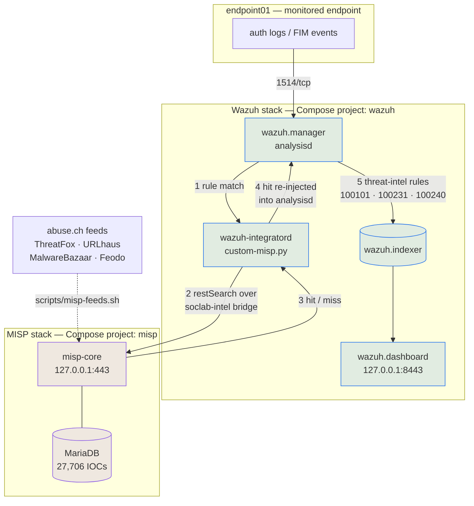

# SOC Home Lab — Wazuh + MISP

A local, Docker-only security operations lab that pairs **Wazuh** (SIEM/XDR) with
**MISP** (threat intelligence platform), so that alerts raised by Wazuh are automatically
enriched with real-world threat intel.

Built as a portfolio project to demonstrate SIEM deployment, detection engineering mapped
to MITRE ATT&CK, threat-intel integration, and an end-to-end incident response workflow —
all reproducible on a single machine with nothing but Docker.

Everything here runs. Every detection has been fired against live input, every alert
quoted in the documentation was captured from the running lab, and **157 automated checks**
assert it still works.

## At a glance

| | |
|---|---|
| **Stack** | Wazuh 4.14.7 (manager, indexer, dashboard, agent) · MISP 2.5.44 (core, modules, MariaDB, Valkey, mail) |
| **Footprint** | 9 containers, ~3.9 GB RAM, ~22 GB disk (11.6 GB images + 10.6 GB volumes) |
| **Threat intel** | 27,706 indicators from 4 curated abuse.ch feeds, loaded via the MISP API |
| **Detections** | 5 custom rules + 1 correlation rule, all mapped to MITRE ATT&CK |
| **Verification** | 157 checks across 6 suites |
| **Exposure** | Loopback only — no published port is reachable off the host |

## Architecture



Wazuh collects and detects; MISP holds the threat intel; the integration joins them. The
load-bearing detail is **step 4**: a MISP hit is written back into analysisd as a new event
rather than sent somewhere as a notification, so it is decoded, matched by rules, indexed
and correlated exactly like any other alert.

## Screenshots

| Wazuh — enriched alert | MISP — the matched indicator |
|---|---|
|  |  |

| MITRE ATT&CK panel | Alert JSON showing the MISP pivot |
|---|---|
|  |  |

## Quick start

**Prerequisites:** Docker Engine + Compose v2 ≥ 2.24, ~6 GB free RAM, ~25 GB free disk,
`vm.max_map_count` ≥ 262144, and membership of the `docker` group. Built and tested on
Fedora with SELinux enforcing.

```bash
git clone <this-repo> Project && cd Project

scripts/wazuh-bootstrap.sh    # clone upstream @ v4.14.7, generate .env, generate TLS certs
scripts/wazuh-passwords.sh    # replace the shipped demo credentials  ← before first start
scripts/misp-bootstrap.sh     # pinned clone, bind-mount dirs, generate misp/.env
scripts/misp-up.sh            # start MISP, wait for misp-core to report healthy  (~35s)
scripts/wazuh-up.sh           # start Wazuh, wait for the indexer to go green     (~25s)
scripts/misp-feeds.sh         # pull ~27k indicators from four abuse.ch feeds
```

Two ordering rules, both silent if missed: **`wazuh-passwords.sh` before the first
`wazuh-up.sh`** (a cold start seeds the indexer's security index from the passwords file;
run later, it rotates instead), and **`misp-bootstrap.sh` before `wazuh-up.sh`** (the
manager's MISP API key is rendered from `misp/.env` at start-up, so without it every lookup
silently 403s). Every script is idempotent.

**Confirm it works:**

```bash
scripts/wazuh-check.sh  scripts/misp-check.sh  scripts/misp-feeds-check.sh
scripts/misp-integration-check.sh  scripts/detections-check.sh  scripts/incident-check.sh
```

| UI | URL | Credentials |
|---|---|---|
| Wazuh dashboard | <https://127.0.0.1:8443> | `admin` / `INDEXER_PASSWORD` from `.env` |
| MISP | <https://127.0.0.1> | `admin@soclab.local` / `ADMIN_PASSWORD` from `misp/.env` |

**Day-to-day:**

```bash
scripts/wazuh-up.sh  scripts/misp-up.sh       # start (state lives in named volumes)
scripts/wazuh-down.sh  scripts/misp-down.sh   # stop  (--purge also deletes volumes)
scripts/demo-incident.sh                      # replay the full intrusion, ~2 min
```

## Detections

Five custom rules plus one correlation rule, each mapped to MITRE ATT&CK and each proven
by a captured alert. Every one **builds on** Wazuh's stock ruleset with `<if_sid>` /
`<if_matched_sid>` rather than replacing it — what stock lacks is context, not coverage.

| Rule | Level | Detection | ATT&CK |
|---|---|---|---|
| `100200` | 14 | **D1** — successful SSH login from a source that was brute-forcing moments ago | [T1110.001](https://attack.mitre.org/techniques/T1110/001/), [T1078](https://attack.mitre.org/techniques/T1078/) |
| `100210` | 12 | **D2** — security-critical file created or modified (sudoers, cron, `authorized_keys`, passwd) | [T1098.004](https://attack.mitre.org/techniques/T1098/004/), [T1053.003](https://attack.mitre.org/techniques/T1053/003/), [T1136](https://attack.mitre.org/techniques/T1136/) |
| `100220` | 12 | **D3** — new executable dropped into a system binary directory | [T1036.005](https://attack.mitre.org/techniques/T1036/005/), [T1543](https://attack.mitre.org/techniques/T1543/) |
| `100231` | 13 | **D4** — outbound connection to infrastructure MISP knows | [T1071.001](https://attack.mitre.org/techniques/T1071/001/), [T1571](https://attack.mitre.org/techniques/T1571/) |
| `100240` | 13 | **D5** — authentication attack from a threat-intel-listed host | [T1110.001](https://attack.mitre.org/techniques/T1110/001/) |
| `100103` | 14 | **Correlation** — repeated intel matches from one host across different signals | — |

Stock Wazuh already detects brute force and file-integrity changes, so each custom rule
adds only what stock lacks: a brute force that **succeeded**, a file change **where it
matters**, a destination that is **known-bad**.

```bash
scripts/demo-detections.sh     # simulate all five, safely
scripts/detections-check.sh    # 27 checks
```

## Incident report

[**INC-2026-001 — SSH credential compromise of `endpoint01`**](docs/incident-report-example.md)
walks one simulated intrusion end to end: a host MISP already lists as botnet C2
brute-forces the endpoint, gets in, establishes three persistence mechanisms, drops an
implant and beacons back to infrastructure from the same feed — **45 alerts in 52 seconds**,
all real, all captured. It covers the timeline, the MISP enrichment findings, the response
an analyst would run, and two detections that were found silently not working until the
full intrusion was replayed across all of them at once.

```bash
scripts/demo-incident.sh       # replay the intrusion, ~2 min
scripts/incident-check.sh      # 47 checks, report against evidence
```

## Verifying the lab

| Suite | Checks | Covers |
|---|---:|---|
| `wazuh-check.sh` | 17 | Stack health, credentials rotated, agent active, alerts indexed, loopback-only exposure |
| `misp-check.sh` | 15 | Health, API auth, default logins rejected, no plaintext credentials in logs |
| `misp-feeds-check.sh` | 25 | Feeds registered and parsed correctly, IOCs searchable, benign controls miss |
| `misp-integration-check.sh` | 26 | Network path, key substitution, file modes, live lookup, private-IP filter |
| `detections-check.sh` | 27 | Rules defined, loaded, ATT&CK-mapped, each firing — and negatives staying quiet |
| `incident-check.sh` | 47 | The incident report against its own evidence, plus regression guards |
| **Total** | **157** | |

A detection is not treated as real until it's been watched firing against live input —
Wazuh fails silently in more ways than it fails loudly, and five of the six rule-writing
traps documented in [`docs/detections.md`](docs/detections.md) produce no error at all.

## Repository layout

```
├── scripts/          bootstrap, up/down, feeds, demos, and six check suites
├── wazuh/
│   ├── compose.override.yml    loopback binding, config mounts, shared network
│   ├── config/                 tracked manager config (API key placeholder only)
│   ├── rules/local_rules.xml   all custom detections
│   └── integrations/           custom-misp.py — the MISP enrichment integration
├── misp/
│   ├── compose.override.yml    loopback binding, shared network
│   └── feeds.json              the feed list, as reviewable data
├── agents/           the monitored endpoint and its ossec.conf
└── docs/             one document per phase, plus the incident report
```

Upstream `wazuh-docker` and `misp-docker` are cloned at pinned versions into gitignored
directories, so the diff from a stock deployment is small and auditable — everything this
project changes lives in the two override files, the rules file and the integration.

## Documentation

- [`docs/setup-wazuh.md`](docs/setup-wazuh.md) — deploying and hardening the Wazuh stack
- [`docs/setup-agent.md`](docs/setup-agent.md) — the monitored endpoint, and proving events flow
- [`docs/setup-misp.md`](docs/setup-misp.md) — deploying and hardening MISP
- [`docs/threat-intel-feeds.md`](docs/threat-intel-feeds.md) — loading threat intel into MISP, and proving it is searchable
- [`docs/integration-wazuh-misp.md`](docs/integration-wazuh-misp.md) — wiring the SIEM to the intel platform, and the traps in doing it
- [`docs/detections.md`](docs/detections.md) — the custom detections, their ATT&CK mapping, and six Wazuh behaviours that fail silently
- [`docs/incident-report-example.md`](docs/incident-report-example.md) — INC-2026-001: one simulated intrusion, detection to remediation
- [`docs/roadmap.md`](docs/roadmap.md) — what I'd improve before this touched a real network
- [`docs/project-notes.md`](docs/project-notes.md) — running build notes: the decisions, the traps, and why each phase went the way it did

## Safety and ground rules

- **Docker only** — no cloud provider, no hypervisor, no full VMs.
- **Localhost only** — no published port is reachable beyond `127.0.0.1`.
- **No secrets in git** — credentials live in gitignored `.env` files; three check suites
  assert nothing leaked into a tracked file.
- **Nothing ever connects to a malicious address.** All attack simulation is log injection
  parsed by Wazuh's stock decoders, plus real-but-inert file changes.

Built with Wazuh 4.14.7 and MISP 2.5.44, on Fedora with SELinux enforcing.
