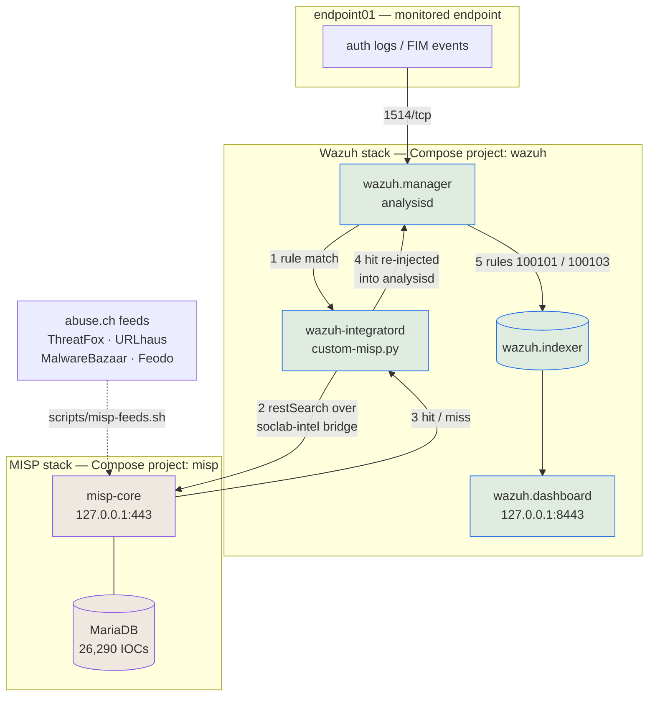

# SOC Home Lab — Wazuh + MISP

A local, Docker-only security operations lab that pairs **Wazuh** (SIEM/XDR) with
**MISP** (threat intelligence platform), so that alerts raised by Wazuh are
automatically enriched with real-world threat intel.

Built as a portfolio project to demonstrate SIEM deployment, detection engineering
mapped to MITRE ATT&CK, threat intel integration, and an end-to-end incident response
workflow — all reproducible on a single machine with nothing but Docker.

> **Status:** work in progress — Phase 8 (final documentation pass) remains. Quick-start
> instructions and example alert excerpts land with it.

## Build log

| Phase | Scope | Status |
|------:|-------|--------|
| 0 | Environment check, repo scaffolding | Done |
| 1 | Deploy Wazuh single-node (manager, indexer, dashboard) | Done |
| 2 | Feed real data into Wazuh via an agent | Done |
| 3 | Deploy MISP | Done |
| 4 | Populate MISP from a public threat feed | Done |
| 5 | Integrate Wazuh with MISP for alert enrichment | Done |
| 6 | Custom detection rules mapped to MITRE ATT&CK | Done |
| 7 | Simulated end-to-end incident report | Done |
| 8 | Final documentation pass | Not started |

## Architecture



Wazuh collects and detects; MISP holds the threat intel; the integration joins them. The
load-bearing detail is **step 4**: a MISP hit is written back into analysisd as a new
event rather than sent somewhere as a notification, so it is decoded, matched by rules,
indexed and correlated exactly like any other alert.

## Detections

Five custom rules, each mapped to MITRE ATT&CK and each proven by a captured alert in
[`docs/detections/phase6-alerts.json`](docs/detections/phase6-alerts.json). Every one
builds on Wazuh's stock ruleset rather than replacing it — what stock lacks is context,
not coverage.

| Rule | Level | Detection | ATT&CK |
|---|---|---|---|
| 100200 | 14 | Successful SSH login from a source that was brute-forcing moments ago | T1110.001, T1078 |
| 100210 | 12 | Security-critical file created or modified (sudoers, cron, authorized_keys, passwd) | T1098.004, T1053.003, T1136 |
| 100220 | 12 | New executable dropped into a system binary directory | T1036.005, T1543 |
| 100231 | 13 | Outbound connection to infrastructure MISP knows | T1071.001, T1571 |
| 100240 | 13 | Authentication attack from a threat-intel-listed host | T1110.001 |

```bash
scripts/demo-detections.sh     # simulate all five, safely
scripts/detections-check.sh    # 27 checks
```

## Incident report

[**INC-2026-001 — SSH credential compromise of `endpoint01`**](docs/incident-report-example.md)
walks one simulated intrusion end to end: a host MISP already lists as botnet C2
brute-forces the endpoint, gets in, establishes three persistence mechanisms, drops an
implant and beacons back to infrastructure from the same feed. Every alert quoted is real
and captured in [`docs/incidents/incident-001-alerts.json`](docs/incidents/incident-001-alerts.json).

The report covers the timeline, the MISP enrichment findings, the response an analyst
would run, and — because the exercise found them — **two detections that were silently not
working** until an intrusion was replayed across all of them at once.

```bash
scripts/demo-incident.sh       # replay the intrusion, ~2 min
scripts/incident-check.sh      # 47 checks, report against evidence
```

## Documentation

- [`docs/setup-wazuh.md`](docs/setup-wazuh.md) — deploying and hardening the Wazuh stack
- [`docs/setup-agent.md`](docs/setup-agent.md) — the monitored endpoint, and proving events flow
- [`docs/setup-misp.md`](docs/setup-misp.md) — deploying and hardening MISP
- [`docs/threat-intel-feeds.md`](docs/threat-intel-feeds.md) — loading threat intel into MISP, and proving it is searchable
- [`docs/integration-wazuh-misp.md`](docs/integration-wazuh-misp.md) — wiring the SIEM to the intel platform, and the traps in doing it
- [`docs/detections.md`](docs/detections.md) — the five custom detections, their ATT&CK mapping, and four Wazuh behaviours that fail silently
- [`docs/incident-report-example.md`](docs/incident-report-example.md) — INC-2026-001: one simulated intrusion, detection to remediation
- [`docs/project-notes.md`](docs/project-notes.md) — running build notes: the decisions, the traps, and why each phase went the way it did

## Ground rules

This lab is deliberately constrained:

- **Docker only** — no cloud provider, no hypervisor, no full VMs.
- **Localhost only** — no published port is reachable beyond `127.0.0.1`.
- **No secrets in git** — all credentials live in a gitignored `.env`; `.env.example`
  documents the required keys.
