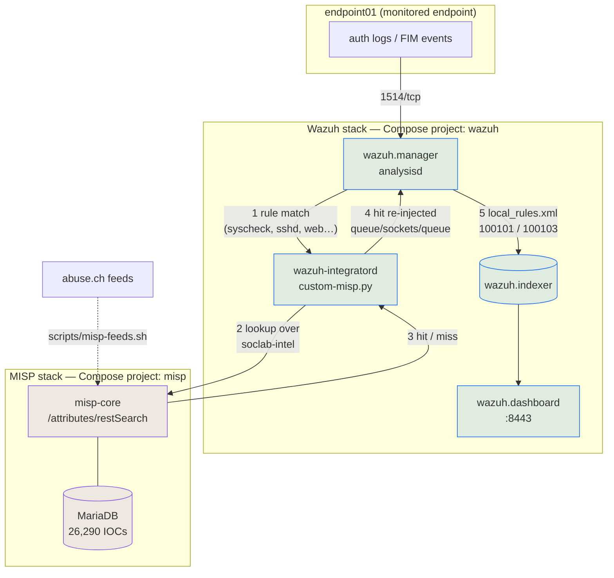

# Integrating Wazuh with MISP

Phase 5 of the lab: connecting the SIEM to the threat-intel platform, so that a Wazuh
alert containing an IP, domain, URL or file hash is automatically checked against the
26,000 indicators loaded in Phase 4 — and, when it matches, becomes a *new* alert that
says so.

This is the phase where the two halves of the lab stop being two separate products.

## Wazuh does not ship a MISP integration

Worth stating plainly, because the plan assumed otherwise. The manager image ships
integrations for **VirusTotal, Maltiverse, Slack, PagerDuty and Shuffle** — and nothing
for MISP:

```console
$ docker exec wazuh-wazuh.manager-1 ls /var/ossec/integrations/
maltiverse  maltiverse.py  pagerduty  pagerduty.py  shuffle  shuffle.py
slack  slack.py  virustotal  virustotal.py
```

A search for "misp" across `/var/ossec/integrations`, `/var/ossec/etc` and
`/var/ossec/ruleset` returns nothing. So this phase **writes** an integration rather
than enabling one. What Wazuh does provide is the framework — `wazuh-integratord`, a
documented calling convention, and a queue socket to write results back into — and that
framework is what the code below plugs into. `virustotal.py` in the image served as the
reference for the socket protocol, which is not otherwise documented in a form you can
copy safely.

## Architecture



The key move is **step 4**. The integration does not merely notify something; it writes
the MISP result back into analysisd as a fresh event. That result is then decoded and
matched by rules like any other input, which means an enriched hit indexes, appears in
the dashboard, participates in correlation, and could drive active response — all for
free, because it re-enters the pipeline instead of bypassing it.

## The network problem

The two stacks run as **separate Compose projects**, each with its own default bridge.
Nothing routed between them, so the manager could not reach the MISP API at all.

The fix is one user-defined bridge, `soclab-intel`, created outside Compose by
`ensure_shared_network()` in `scripts/_common.sh` and declared `external: true` in both
overrides. Only the two services that need it attach: `wazuh.manager` and `misp-core`.

Three decisions inside that are easy to get wrong:

- **The stacks stay separate projects.** Merging them into one would have made the
  network trivial, at the cost of tying their lifecycles together — MISP is the heavy
  half and wants stopping on its own.
- **The bridge is `--internal`.** It has no gateway off the host. It exists to carry
  manager→MISP traffic, and an internal bridge cannot become an accidental egress path.
  Both containers keep their own default networks for the outside world.
- **`default` must be listed explicitly.** Upstream declares no `networks:` key on
  either service, so the moment an override adds one, the implicit default is
  *replaced*, not extended. Omitting it cuts the manager off from the indexer, and MISP
  off from its own database. Both check scripts assert the default survived, because the
  failure looks like an unrelated outage.

## Owning the manager configuration

Enabling an integration means editing the manager's `ossec.conf`, which upstream
bind-mounts from `wazuh/wazuh-docker/single-node/config/wazuh_cluster/wazuh_manager.conf`.
That tree is a **pinned, gitignored, disposable clone** — editing it there would be
untracked and would vanish at the next bootstrap.

So the file moves into the tracked tree as `wazuh/config/wazuh_manager.conf`, an exact
copy of upstream's with two changes, and the mount is redirected to it.

Redirecting the mount needs `volumes: !override`, for the same reason the `ports`
overrides needed it in Phase 1: Compose **concatenates** service `volumes` lists across
`-f` files. Adding our mount would have kept upstream's too, and two mounts on the same
container path collide. Overriding means restating upstream's list; the entries below
the `--- ours below this line ---` marker are the only additions.

### Keeping the API key out of git

The `<integration>` block needs a MISP API key, and the config file is tracked. So the
tracked file holds a placeholder:

```xml
<api_key>MISP_API_KEY_PLACEHOLDER</api_key>
```

and `scripts/wazuh-up.sh` renders a real copy into `wazuh/config/generated/`
(already covered by `.gitignore`'s `**/config/generated/`) at mode `600`, which is what
actually gets mounted. The check script asserts all three properties: the template still
has the placeholder, the rendered copy is gitignored and mode 600, and the placeholder
did *not* survive into the running config — because if it had, every lookup would 403
and the lab would look healthy while enriching nothing.

## What the integration does

`wazuh/integrations/custom-misp.py`, invoked by integratord as
`custom-misp <alert-file> <api-key> <hook-url>`:

1. **Extracts observables** from an explicit table of alert fields — `data.srcip`,
   `syscheck.sha256_after`, `data.dns.question.name` and so on.
2. **Filters** them: private, loopback, link-local, multicast and reserved IPs are
   dropped before any lookup.
3. **Queries** `POST /attributes/restSearch` once per unique observable.
4. **Re-injects** each hit into `queue/sockets/queue`, preserving the originating agent
   so the enriched alert is attributed to the endpoint rather than the manager.

Two of those deserve their reasoning spelled out.

**Why an explicit field table, not a recursive scrape.** Walking the alert JSON for
anything IP-shaped is less code and much worse: it collects the agent's own address, the
manager's hostname, and every hash of every file an alert happens to mention. Each is a
MISP round-trip that can only ever return a miss.

**Why private IPs are filtered.** In this lab they would simply miss. But in any
deployment where MISP is not local, sending them means broadcasting internal addressing
to a third party. The check script tests this as its own case — asserting the address is
*never sent*, not merely that it does not match.

## The rules

`wazuh/rules/local_rules.xml` uses the 100100–100199 range. Wazuh reserves everything
below 100000 for its own ruleset, so staying inside the user range means an upgrade
shipping new built-in rules can never collide.

| Rule | Level | Fires when |
|---|---|---|
| 100100 | 0 | any MISP lookup result (parent; never alerts on its own) |
| 100101 | 12 | hit on an indicator with `to_ids=True` — actionable |
| 100102 | 6 | hit on context-only intel (`to_ids=False`) |
| 100103 | 14 | 4+ hits from the same agent within 5 minutes |

**Splitting on `to_ids` is the point.** MISP marks an attribute `to_ids` when it is
considered reliable enough to alert on, as opposed to context worth recording. Treating
both identically would turn enrichment into a second stream of noise; an analyst who
cannot tell the two apart stops reading either.

**100100 is level 0 deliberately** — it exists to be inherited from. A level 0 parent
keeps an unclassified result out of the alert stream instead of firing alongside its own
child.

## Two things that had to be found by running it

### `$(agent.name)` does not expand in a rule description

Rule descriptions expand `$(field)` only for **decoded** fields. `$(agent.name)` renders
as empty even though the alert is correctly attributed to the agent — producing
`known-bad ip seen on  — ...`. The fix is for the integration to carry the agent name in
its own payload as `misp.agent_name`, which is also what rule 100103 correlates on via
`<same_field>`.

That correlation detail matters too: the obvious `<same_source_ip />` would never have
fired, because these events are *injected* by the integration and carry no `srcip` of
their own. It would have sat there looking correct and never matching.

### Bind-mounted scripts and the `wazuh` user

`wazuh-integratord` runs as the `wazuh` user (uid 999). Bind-mounted files keep their
**host** ownership (uid 1000 here), so the owner and group bits apply to nobody relevant
inside the container — only the world bits decide whether the file can be read.

A mode-750 `custom-misp.py` therefore failed with:

```
ERROR: While running custom-misp -> integrations. Output:
  can't open file '/var/ossec/integrations/custom-misp.py': [Errno 13] Permission denied
```

This is easy to misdiagnose, because testing by hand works fine — `docker exec` runs as
root. The integration must be world-readable (644) and the wrapper world-executable
(755). Git tracks only the executable bit, so `wazuh-up.sh` asserts the modes rather
than trusting the checkout.

## The agent re-enrollment defect this phase exposed

Recreating the agent container made it fail permanently with:

```
ERROR: Duplicate agent name: endpoint01. Unable to add agent (from manager)
```

The agent does not persist `/var/ossec/etc`, so a container recreate loses its
`client.keys` and it must enroll again — and `authd` refuses, because the previous
registration still owns the name. The agent then retries that same error forever while
the manager reports it as merely disconnected.

The fix is `<force>` inside `<auth>`, letting a re-registering agent replace its own
stale record. The alternative — persisting the agent's `/var/ossec/etc` — would keep the
key but also pin the *old* `ossec.conf` inside the volume and silently ignore edits to
the bind-mounted one, which is worse in a lab whose agent config changes every phase.

The timers are `0` here because a re-registration in this lab is always a deliberate
container recreate. **On a real network they should not be**: those timers are what stop
an attacker re-registering as an existing endpoint to blind it.

## A logcollector behaviour worth knowing

`wazuh-logcollector` opens each `<localfile>` once at startup. If the path is missing at
that moment it logs `Could not open file` — and never retries. The file can appear
seconds later and be written to forever; it will not be read until logcollector
restarts.

This cost real debugging time: the demo wrote ten perfectly good log lines, the file
contained them, logcollector had even logged `Analyzing file` for the path, and no alert
appeared. The fix is a named volume so the directory persists, plus a guard in the demo
that verifies logcollector actually holds the file open (via `/proc/<pid>/fd`) and
restarts the agent's daemons if not.

## Demo

```bash
scripts/demo-misp-enrichment.sh
```

Simulates five failed SSH logins from an IP taken live from MISP, and five from
`203.0.113.45` (RFC 5737 TEST-NET-3 — routable-looking, reserved for documentation, and
guaranteed never to be in a real feed). Both trigger Wazuh rule 5710; only the first
produces a threat-intel alert.

```
  rule 100101  level 12
    MISP: known-bad ip seen on endpoint01 — ip-dst matched threat intel [triggered by rule 5710]
    observable   : 162.243.103.246 (ip)
    MISP type    : ip-dst   category: Network activity
    to_ids       : True   MISP event: 1
    triggered by : rule 5710 — sshd: Attempt to login using a non-existent user

  rule 100103  level 14
    MISP: repeated threat-intel matches from endpoint01 — possible active compromise

  PASS  203.0.113.45 triggered rule 5710 but no MISP alert
```

**Nothing in this lab ever connects to the malicious address.** The attack is simulated
entirely by writing syslog lines that Wazuh's stock `sshd` decoder parses — the same
decoder, rules and alert path the real thing would take. Actually contacting a live C2
server to test a detection would be indefensible.

## Verify

```console
$ scripts/misp-integration-check.sh
26 passed, 0 failed
```

Covering the network path (including that both containers kept their default networks),
the configuration and key substitution, file modes, all four rules and that analysisd
loaded them, a live known-bad lookup, a benign control, the private-IP filter, indexed
end-to-end evidence, and secrets hygiene.

One check is scoped deliberately: the "integratord reported no failures" test looks only
at the **current** integratord run. `ossec.log` lives in a named volume and outlives
every container recreate, so an unscoped grep keeps reporting faults fixed hours ago —
and a check that never forgets is a check nobody believes.

## Not done here

- **TLS verification is disabled** on the manager→MISP call. MISP presents a self-signed
  certificate on an internal bridge with no route off the host, and there is no CA to
  verify against. Against a real MISP this must become its CA bundle path; the code
  comments say so at the call site.
- **The API key is passed as a command-line argument**, because that is integratord's
  calling convention. It is therefore visible in `ps` inside the manager container. Not
  fixable without patching Wazuh, but worth knowing rather than discovering.
- **No caching.** Every observable is a fresh MISP round-trip. Fine at lab volume,
  wasteful at real volume — a short-TTL cache of misses is the obvious first optimisation.
- **Only the manager enriches.** That is the right design (agents should not hold API
  keys) but it means enrichment stops if the manager is saturated.

## Next

Phase 6: custom detection rules mapped to MITRE ATT&CK. The groundwork is already here —
rule 5710 arrives carrying `T1110.001` (Password Guessing), and the simulated auth log
gives a safe way to drive brute-force scenarios.
