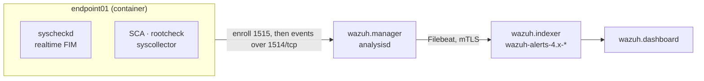

# Phase 2 — feeding real data into Wazuh

A stack with no agents is three idle containers. This phase adds a monitored
endpoint, `endpoint01`, and proves real events travel all the way from the endpoint
into the indexer and onto the dashboard.

The endpoint is a container running the official `wazuh/wazuh-agent:4.14.7` image —
same version as the stack — so the lab stays Docker-only and nothing is installed on
the host.

## Event path



Nothing here is published to the host. The agent reaches the manager over the Compose
project's internal network, so ports 1514/1515 stay loopback-only.

## Enrollment

Registration is automatic. The manager's `authd` listens on 1515 with
`<use_password>no</use_password>`, so the agent presents a name and receives a key.

The image's init script reads these variables — note the name, it is
**`WAZUH_MANAGER_SERVER`**, not the `WAZUH_MANAGER` that the distro agent packages
use:

| Variable | Value here | Default |
|---|---|---|
| `WAZUH_MANAGER_SERVER` | `wazuh.manager` | — |
| `WAZUH_MANAGER_PORT` | 1514 | 1514 |
| `WAZUH_REGISTRATION_PORT` | 1515 | 1515 |
| `WAZUH_AGENT_NAME` | `endpoint01` | `wazuh-agent-$HOSTNAME` |
| `WAZUH_AGENT_GROUP` | `default` | `default` |

Seeing `ERROR: (1208): Unable to connect to enrollment service` in the agent log
shortly after `up` is normal — the agent starts before the manager finishes booting
and retries every ten seconds until it succeeds.

## Agent configuration

[`agents/config/ossec.conf`](../agents/config/ossec.conf) is the image's own default
with three deliberate changes, each marked `LAB CHANGE`. The unmodified original sits
beside it as `ossec.conf.upstream` for diffing.

| Change | Why |
|---|---|
| `realtime="yes"` on `/etc,/usr/bin,/usr/sbin` | Stock config only rescans every `<frequency>` — 12 hours. A change made now would not alert until tomorrow. Realtime uses inotify and alerts in seconds. |
| `<alert_new_files>yes</alert_new_files>` | Off by default, so a *newly dropped* file produces no alert at all — exactly the case that matters for detecting a planted webshell or dropped binary. |
| `/var/lab` monitored with `report_changes="yes"` | A staging directory for file-integrity scenarios. `report_changes` records the content diff, so the alert shows *what* changed rather than only that something did. |

The file is mounted at `/wazuh-config-mount/etc/ossec.conf`. The image copies that into
`/var/ossec` **before** substituting the `CHANGE_*` placeholders, so our config keeps the
placeholders and enrollment stays driven by the environment variables above.

## What the agent reports

Out of the box `endpoint01` produces genuine telemetry — no synthetic log injection:

- **SCA** — a CIS Amazon Linux 2023 benchmark scan, the bulk of the initial alerts
- **FIM** — realtime integrity monitoring on system directories and `/var/lab`
- **rootcheck** — policy and rootkit checks
- **syscollector** — hardware, OS, package and network inventory

## Verify

```bash
scripts/wazuh-check.sh    # 17 checks, including agent Active and alerts indexed
scripts/demo-fim.sh       # trigger the full FIM lifecycle and read the alerts back
```

`demo-fim.sh` creates, modifies and deletes a file in `/var/lab` and then queries the
indexer for the result:

```
  RULE  LVL  EVENT     DESCRIPTION
  554   5    added     File added to the system.
  550   7    modified  Integrity checksum changed.
  553   7    deleted   File deleted.
```

That exercises the whole chain — inotify on the agent, `analysisd` on the manager,
Filebeat, and the indexer — so a pass means the pipeline genuinely works rather than
just that the containers are up.

Manual equivalents:

```bash
# Registered agents and their state
docker exec wazuh-wazuh.manager-1 /var/ossec/bin/agent_control -l

# The agent's own view
docker exec wazuh-wazuh.agent.endpoint01-1 tail -30 /var/ossec/logs/ossec.log
```

In the dashboard, open **Agents → endpoint01**, or filter any view on
`agent.name: endpoint01`.

## Troubleshooting

**Agent stuck at `Never connected` or `Pending`.** `Pending` is a normal transient
state right after enrollment; it becomes `Active` once the first keepalive lands
(~30s). If it stays `Never connected`, the agent got a key but cannot reach 1514 —
check `docker exec wazuh-wazuh.agent.endpoint01-1 tail /var/ossec/logs/ossec.log`.

**Config changes appear to be ignored.** The mount only feeds
`/wazuh-config-mount`; the init copies it at container start. Restart the agent
(`docker compose -p wazuh restart wazuh.agent.endpoint01`) rather than expecting a
live reload. On SELinux hosts also confirm the file is readable —
`scripts/wazuh-up.sh` relabels `agents/config` to `container_file_t` on every start.

**Agent Active but no alerts indexed.** The break is downstream of the agent. Check
`docker exec wazuh-wazuh.manager-1 filebeat test output`.

**No FIM alert when creating a file.** Confirm the change actually landed in the
running config — the placeholders and lab changes should both be present:

```bash
docker exec wazuh-wazuh.agent.endpoint01-1 \
  grep -E 'realtime|alert_new_files' /var/ossec/etc/ossec.conf
```

## Not done here

No SSH service on the endpoint yet, so there is nothing to brute-force and no
`/var/log/secure` to read. Authentication log collection is deliberately left out
rather than configured against a file that does not exist, which would only produce
recurring logcollector warnings. Phase 6 adds `sshd` plus a syslog daemon along with
the detection rules that consume them.

## Next

Phase 3: deploy MISP.
