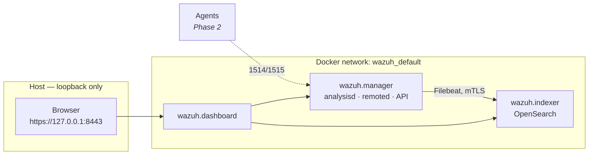

# Deploying the Wazuh stack

Phase 1 of the lab: a single-node Wazuh deployment — manager, indexer and dashboard —
running in Docker, bound to loopback, with the shipped demo credentials replaced.

Upstream [`wazuh/wazuh-docker`](https://github.com/wazuh/wazuh-docker) is used unmodified
at tag **v4.14.7**. Everything this project changes lives in
[`wazuh/compose.override.yml`](../wazuh/compose.override.yml), so the diff from a stock
deployment is easy to audit.

> v5.0.0 exists but was still at `beta4` when this was built, so the lab pins the newest
> stable 4.x release.

## Architecture



## Prerequisites

- Docker Engine and Compose v2. **Compose ≥ 2.24 is required** — the override relies on
  the `!override` YAML tag.
- ~6 GB RAM free and ~10 GB disk. The indexer alone takes a 1 GB JVM heap.
- `vm.max_map_count` ≥ 262144 (`sysctl vm.max_map_count`). Fedora already defaults far
  above this; on other distros you may need to raise it.
- `htpasswd` (`httpd-tools`) for bcrypt hashing. Optional — the password script falls
  back to the indexer image's own `hash.sh` if it is missing.

### Docker group membership

If `docker ps` fails with a permission error while `getent group docker` clearly lists
your user, the shell is carrying stale credentials. Supplementary groups are granted by
PAM when a **login session** is created, so a group added with `usermod` does not reach
any process in a session that started earlier — opening a new terminal tab is not
enough, because the tab inherits the same session.

Fix it permanently by logging out and back in. To carry on without that, the helper
scripts detect the situation and re-invoke docker through `sg docker`, which applies the
group to a single command.

## Deploy

```bash
scripts/wazuh-bootstrap.sh    # clone upstream, generate .env, generate TLS certs
scripts/wazuh-passwords.sh    # replace the demo credentials
scripts/wazuh-up.sh           # start, then wait for the indexer to go green
scripts/wazuh-check.sh        # verify
```

**Order matters.** Run `wazuh-passwords.sh` *before* the first `wazuh-up.sh`. On a cold
start the indexer initialises its security index directly from `internal_users.yml`, so
the stack comes up already using the new credentials and no further action is needed.
Run the same script later against a live stack and it rotates instead: it pushes the new
config with `securityadmin.sh` and restarts the manager and dashboard.

All three scripts are idempotent.

| Script | Purpose |
|---|---|
| `wazuh-bootstrap.sh` | Clone upstream @ v4.14.7, generate `.env`, SELinux relabel, generate certs |
| `wazuh-passwords.sh` | Rewrite `internal_users.yml` with bcrypt hashes from `.env` |
| `wazuh-up.sh` | Start the stack, block until the indexer reports green |
| `wazuh-down.sh` | Stop (`--purge` also deletes volumes) |
| `wazuh-logs.sh` | Tail logs, optionally for one service |
| `wazuh-check.sh` | Assertions covering health, credentials, agent state and exposure |

## Ports

Upstream publishes on `0.0.0.0` and puts the dashboard on privileged port 443. The
override rebinds everything to `127.0.0.1` and moves the dashboard to 8443.

| Service | Published | Purpose |
|---|---|---|
| Dashboard | `127.0.0.1:8443` → 5601 | Web UI |
| Indexer | `127.0.0.1:9200` | OpenSearch API |
| Manager | `127.0.0.1:1514` | Agent event channel |
| Manager | `127.0.0.1:1515` | Agent enrollment |
| Manager | `127.0.0.1:514/udp` | Syslog ingest |
| Manager | `127.0.0.1:55000` | Manager REST API |

Log in at <https://127.0.0.1:8443> as `admin` with `INDEXER_PASSWORD` from `.env`. The
certificate is self-signed, so the browser will warn.

## Hardening applied

Upstream ships a demo security configuration intended to be replaced. Three changes:

1. **Loopback-only binding.** Nothing is reachable from the network.
2. **Credentials replaced.** `admin`, `kibanaserver` and the `wazuh-wui` API account all
   get 28-character generated passwords, bcrypt cost 12. The published defaults
   (`SecretPassword`, `kibanaserver`, `MyS3cr37P450r.*-`) no longer work — `wazuh-check.sh`
   asserts this by trying them.
3. **Unused demo accounts removed.** Upstream defines six internal users; Wazuh only
   uses two. `kibanaro`, `logstash`, `readall` and `snapshotrestore` all ship with
   published passwords and are dropped. The original file is preserved as
   `internal_users.yml.upstream`.

Secrets live in a gitignored `.env`; [`.env.example`](../.env.example) documents the keys.
No password, certificate or private key is tracked by git, and `wazuh-check.sh` asserts
that too.

## Verification

`scripts/wazuh-check.sh` should report **17 passed, 0 failed** (13 of them belong to this
phase; the rest cover the Phase 2 agent). It checks every service running, cluster health
green, the old defaults rejected, each removed demo account rejected, a JWT from the
manager API, the dashboard responding, loopback-only binding, and no secrets in git.

Two useful manual checks:

```bash
# Manager -> indexer transport, end to end
docker exec wazuh-wazuh.manager-1 filebeat test output

# Which manager daemons are up
docker exec wazuh-wazuh.manager-1 /var/ossec/bin/wazuh-control status
```

`wazuh-clusterd`, `wazuh-maild`, `wazuh-agentlessd`, `wazuh-integratord` and
`wazuh-csyslogd` reporting *not running* is normal — they stay off until configured.
`wazuh-integratord` is the one Phase 5 will enable for MISP enrichment.

## Troubleshooting

**The indexer starts then dies, complaining about certificates or config files.**
SELinux. On an enforcing host the bind-mounted config tree inherits `user_home_t`, which
the `container_t` domain cannot read, and the resulting errors never mention SELinux.
`wazuh-bootstrap.sh` relabels the tree to `container_file_t` before generating
certificates — deliberately before, because SELinux gives new files the type of their
parent directory, so the certificates then come out correctly labelled without a second
pass. To check:

```bash
ls -Zd wazuh/wazuh-docker/single-node/config    # want container_file_t
```

**`chcon: cannot read directory ... wazuh_indexer_ssl_certs: Permission denied`.**
Expected, and not a problem. The generator leaves that directory root-owned and mode
`0500`. Its contents are already labelled correctly, and the containers reach them fine
because the Docker daemon runs as root and resolves each bind-mounted path itself. For
the same reason the scripts test for the *directory*, never a file inside it — an
unprivileged `test -f` on those paths always fails.

**`find: command not found` during certificate generation.** An upstream bug in
`wazuh-certs-tool.sh` (the generator image has no `findutils`). Harmless — all twelve
certificates are still produced.

**The dashboard restarts a few times on first start.** Normal. It retries until the
indexer finishes initialising. `wazuh-up.sh` waits for green before reporting success.

**Ports still show `0.0.0.0` in `docker ps`.** The `!override` tag was not applied,
almost certainly because Compose is older than 2.24. Without it Compose *concatenates*
the two `ports` lists rather than replacing, so upstream's `0.0.0.0` bindings survive
alongside ours. Check with `docker compose ... config | grep host_ip`.

**Changing a password had no effect.** If the stack was already running, editing
`internal_users.yml` alone does nothing — the live config lives in the indexer's security
index. Re-run `scripts/wazuh-passwords.sh`, which detects a running stack and pushes the
change with `securityadmin.sh`.

## Next

Phase 2 registers an agent so real events flow into the manager —
see [`setup-agent.md`](setup-agent.md).
